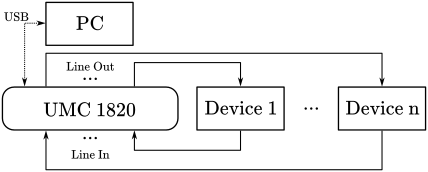

# Expanding the Dataset

This document describes the steps to expand the dataset with more data. First of all, thank you for helping make this dataset larger and better if you decided to do so. Please note, that the storage available on our servers is very limited, so you will very likely need to find space to put the data up yourself. All known additions to the dataset are and will be linked in [README](https://github.com/Mhuzvar/GFXSetCTU#contents) of the repository and in the [devices](https://github.com/Mhuzvar/GFXSetCTU/blob/main/devices.md) file.

## Recording Equipment

Needed:
- Soundcard capable of recording 24-bit 44.1 kHz audio with number of inputs and outputs at least equal to the number of recorded devices
    - almost any commercially available external soundcard on the market should be capable of 24-bit 44.1 kHz recording
    - the dataset is aimed at guitar effects and amplifiers, so inputs and outputs should be 6.3 mm (1/4") jacks
- the recorded device(s)
    - note that the base duration of the input data is approximately 58 minutes. For a device with two potentiometers at 11 settings each this is around 120 hours of recording.
- any recording software
    - [REAPER](https://www.reaper.fm/) project files are available in the repository, but it is not necessary to use REAPER specifically

Recommended:
- [SWS extension](https://www.sws-extension.org/) for Reaper
    - only if using REAPER and the provided project file

## Recording

The recommended recording setup is described in the paper. It consists of routing soundcard output into the input of the recorded device and the output of the recorded device into the input of the soundcard like in the image below.

Once the hardware setup is complete, the process is as follows:

0. Determine settings on the device to be variable
    - for example volume can be typically easily modeled by multiplication and therefore can be omitted
1. Gain Staging
    1. go through the (chosen variable) settings on the device and find the setting that produces the highest peaks on a sample input
    2. play the louder sections of the input sequence through the device and set output gain in your DAW and input gain on the sound card so there is no clipping from recording
2. Record the device
    - set potentiometers to a setting combination
    - mark combination in DAW
        - if using REAPER with SWS extension, the provided project file contains a mark that stops the recording when the sequence is finished
    - record the 58 minute sequence
    - repeat until all settings are recorded

## Post-processing

The current folder contains `sync.py` script to simplify the post-processing as much as possible, but some human input is still necessary. It was originally expected the input and output lag could be matched using cross correlation. While cross-correlation can be used to temporally match the device outputs to each other, the input-output pair is so different in some cases, this method turned out to be too unreliable. The user needs to only set the first delay manually and the script takes care of the rest.

All post-processing is performed by `sync.py` python script in two phases. The first phase is synchronization, which requires some user input. The second phase is cutting the input into short samples, which is performed automatically.
